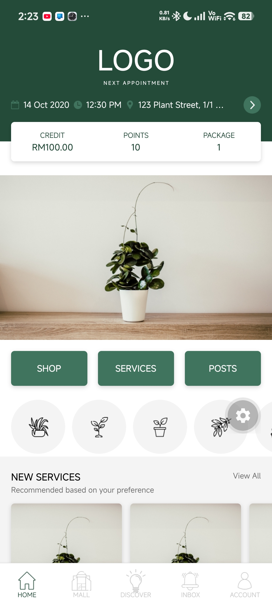
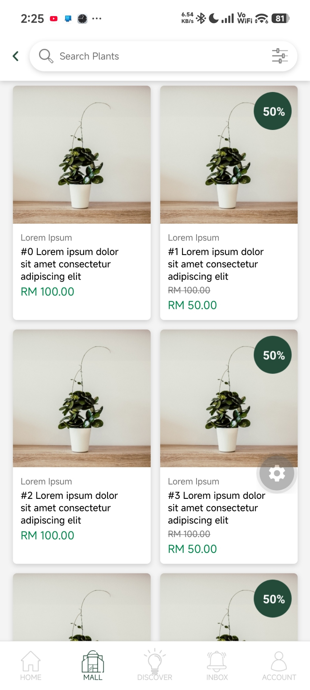
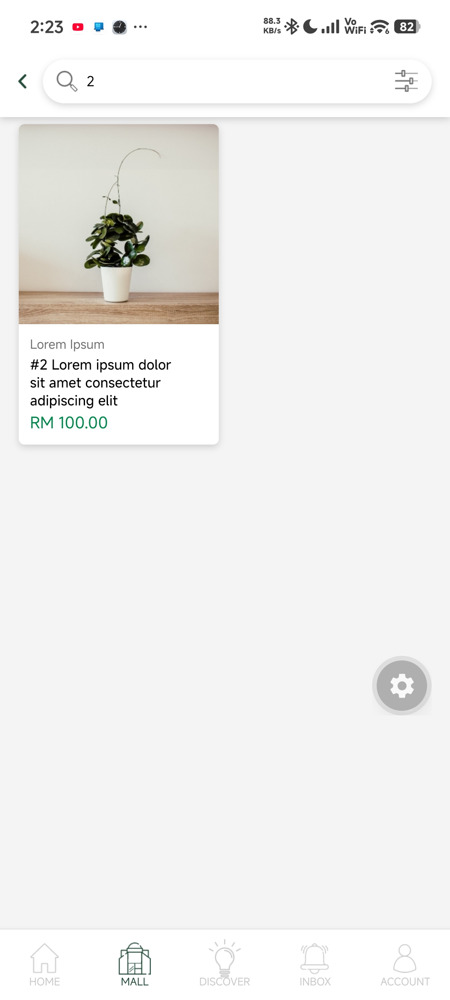
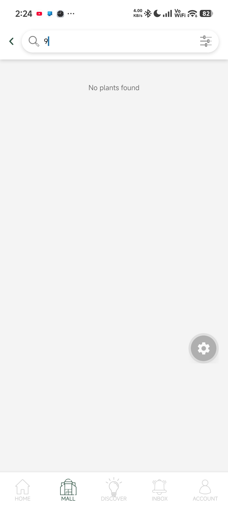

# Plant App

A React Native (Expo) mock of two screens from the plant shop design: **Home** and **Mall**.

## Running it

```bash
pnpm install
pnpm start
```

Scan the QR code with Expo Go (SDK 57) on an Android device, or run `pnpm android` to open it on an emulator.

## Navigation

The app uses a bottom tab bar with five tabs: Home, Mall, Discover, Inbox and Account. Only Home and Mall are built. The other three show a "Coming soon" placeholder.

- Tap **SHOP** on Home, or the **Mall** tab, to open the Mall.
- Tap the back arrow in the Mall header to go back to Home.

| Home | Mall |
| --- | --- |
|  |  |

## Search

The search bar at the top of the Mall filters the product grid by name as you type. It isn't case-sensitive. If nothing matches, the grid shows "No plants found".

| Searching | No results |
| --- | --- |
|  |  |

## Project structure

```
App.js               bottom tab navigation
src/screens/         Home, Mall, ComingSoon
src/components/      Card, CategoryRow, IconBtn
src/data.js          mock data
src/theme.js         shared colors, radius and shadow
assets/              images and icons
```
